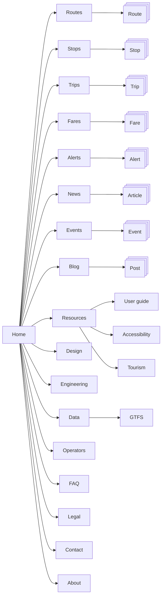
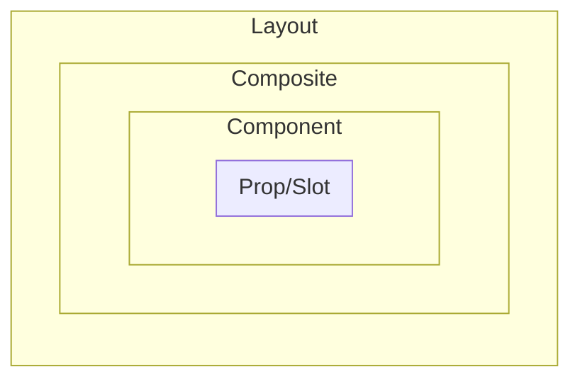

# Site map



Website pages

- Layout
- Composite
- Component
- Prop/Slot



## The list

1. `<domain>/`: Home page
1. `<domain>/routes`: Information on all routes
1. `<domain>/routes/<route_id>`: Route details
1. `<domain>/stops`: Information about all stops
1. `<domain>/stops/<stop_id>`: Stop details
1. `<domain>/trips`: Information about all trips
1. `<domain>/trips/<run_id>`: Trip details
1. `<domain>/fares`: Information about all fares
1. `<domain>/fares/<fare_product_id>`: Fare product details
1. `<domain>/alerts`: Information about all alerts
1. `<domain>/alerts/<entity_id>`: Alert details
1. `<domain>/news`: News and updates about the public transportation service
1. `<domain>/news/<slug>`: News article details
1. `<domain>/blog`: Articles and blog posts related to public transportation
1. `<domain>/blog/<slug>`: Blog post details
1. `<domain>/events`: Information about all events
1. `<domain>/events/<slug>`: Event details
1. `<domain>/resources`: About the public transportation service
1. `<domain>/resources/guide`: Passenger usage guide
1. `<domain>/resources/accessibility`: About accessibility
1. `<domain>/resources/tourism`: Public transport for tourism
1. `<domain>/design`: Information about the visual identity
1. `<domain>/engineering`: Information about the engineering aspects of the public transportation service
1. `<domain>/data`: About public transportation data (`feed_info`)
1. `<domain>/data/gtfs`: About GTFS
1. `<domain>/operators`: About the administrative management of the service
1. `<domain>/faq`: Frequently asked questions
1. `<domain>/legal`: Legal information and terms of use
1. `<domain>/contact`: Contact information
1. `<domain>/about`: About InfoTP

## Details

## `<domain>/`: Home page

## `<domain>/routes`: Information on all routes

## `<domain>/routes/<route_id>`: Route details

### Main Route Detail Layout

**Composites**

1. `RouteHeader`
1. `RouteNextTrips`
1. `RouteSchedule`
1. `RouteMap`
1. `RouteStops`
1. `RouteFares`
1. `RouteAlerts`

#### `RouteHeader`

**Example**

```js
<script setup lang="ts">
    const routeLongName = "Curridabat";
    const routeShortName = "C";
    const routeDesc = "Description of the route";
    const routeType = "Bus";
</script>

<template>
    <RouteLongName size="xl">{{ routeLongName }}</RouteLongName>
    <RouteShortName size="xl">{{ routeShortName }}</RouteShortName>
    <RouteDesc size="xl">{{ routeDesc }}</RouteDesc>
    <RouteType size="xl">{{ routeType }}</RouteType>
</template>
```

**Components**

| Component        | GTFS Field(s)                           |
| ---------------- | --------------------------------------- |
| `RouteLongName`  | `gtfs.schedule.routes.route_long_name`  |
| `RouteShortName` | `gtfs.schedule.routes.route_short_name` |
| `RouteDesc`      | `gtfs.schedule.routes.route_desc`       |
| `RouteType`      | `gtfs.schedule.routes.route_type`       |

#### `RouteNextTrips`

1. `RouteSchedule`
1. `RouteMap`
1. `RouteStops`
1. `RouteFares`
1. `RouteAlerts`

## `<domain>/stops`: Information about all stops

## `<domain>/stops/<stop_id>`: Stop details

## `<domain>/trips`: Information about all trips

## `<domain>/trips/<run_id>`: Trip details

## `<domain>/alerts`: Information about all alerts

## `<domain>/alerts/<entity_id>`: Alert details

## `<domain>/fares`: Information about all fares

## `<domain>/fares/<fare_product_id>`: Fare product details

## `<domain>/news`: News and updates about the public transportation service

## `<domain>/news/<slug>`: News article details

## `<domain>/blog`: Articles and blog posts related to public transportation

## `<domain>/blog/<slug>`: Blog post details

## `<domain>/resources`: About the public transportation service

## `<domain>/resources/guide`: Passenger usage guide

## `<domain>/resources/accessibility`: About accessibility

## `<domain>/resources/tourism`: Public transport for tourism

## `<domain>/operators`: About the administrative management of the service

## `<domain>/data`: About public transportation data (`feed_info`)

## `<domain>/data/gtfs`: About GTFS

## `<domain>/about`: About InfoTP

## `<domain>/contact`: Contact information

## `<domain>/faq`: Frequently asked questions

## `<domain>/legal`: Legal information and terms of use

## `<domain>/design`: Information about the visual identity
