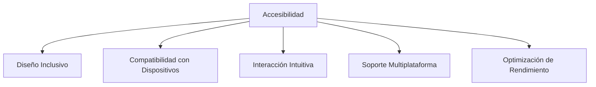

# Experiencia del usuario (UX)

## Accesibilidad

```mermaid
flowchart TD
    A[Accesibilidad] --> B[Diseño Inclusivo]
    A --> C[Compatibilidad con Dispositivos]
    A --> D[Interacción Intuitiva]
    A --> E[Soporte Multiplataforma]
    A --> F[Optimización de Rendimiento]
```
