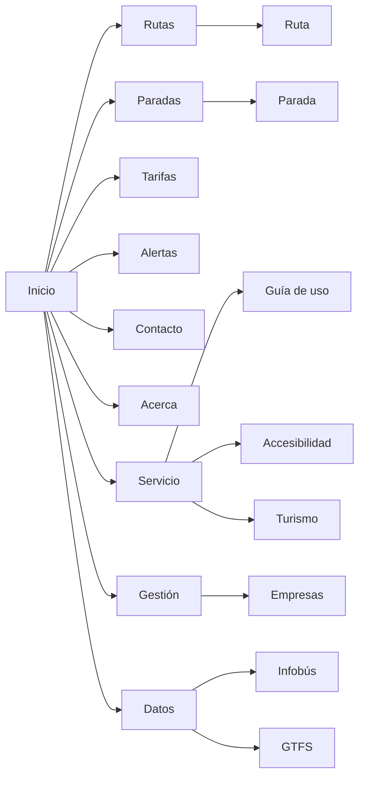

# Mapa del sitio

Ejemplos

1. `infotp.cr/`: Página de inicio
1. `infotp.cr/rutas`: Información de todas las rutas
1. `infotp.cr/rutas/[route_id]`: Detalle de una ruta
1. `infotp.cr/paradas`: Información de todas las paradas
1. `infotp.cr/paradas/[stop_id]`: Detalle de una parada
1. `infotp.cr/tarifas?<params>`: Información de las tarifas, filtrado por parámetros
1. `infotp.cr/alertas?<params>`: Información de las alertas, filtrado por parámetros
1. `infotp.cr/contacto`: Información de contacto
1. `infotp.cr/acerca`: Sobre InfoTP
1. `infotp.cr/servicio`: Sobre el servicio de transporte público
1. `infotp.cr/servicio/guia`: Guía de uso para pasajeros
1. `infotp.cr/servicio/accesibilidad`: Sobre la accesibilidad
1. `infotp.cr/servicio/turismo`: Transporte público para el turismo
1. `infotp.cr/gestion`: Sobre la gestión administrativa del servicio
1. `infotp.cr/gestion/empresas`: Información de las empresas autobuseras
1. `infotp.cr/datos`: Sobre los datos de transporte público (`feed_info`)
1. `infotp.cr/datos/infobus`: Sobre Infobús
1. `infotp.cr/datos/gtfs`: Sobre GTFS
