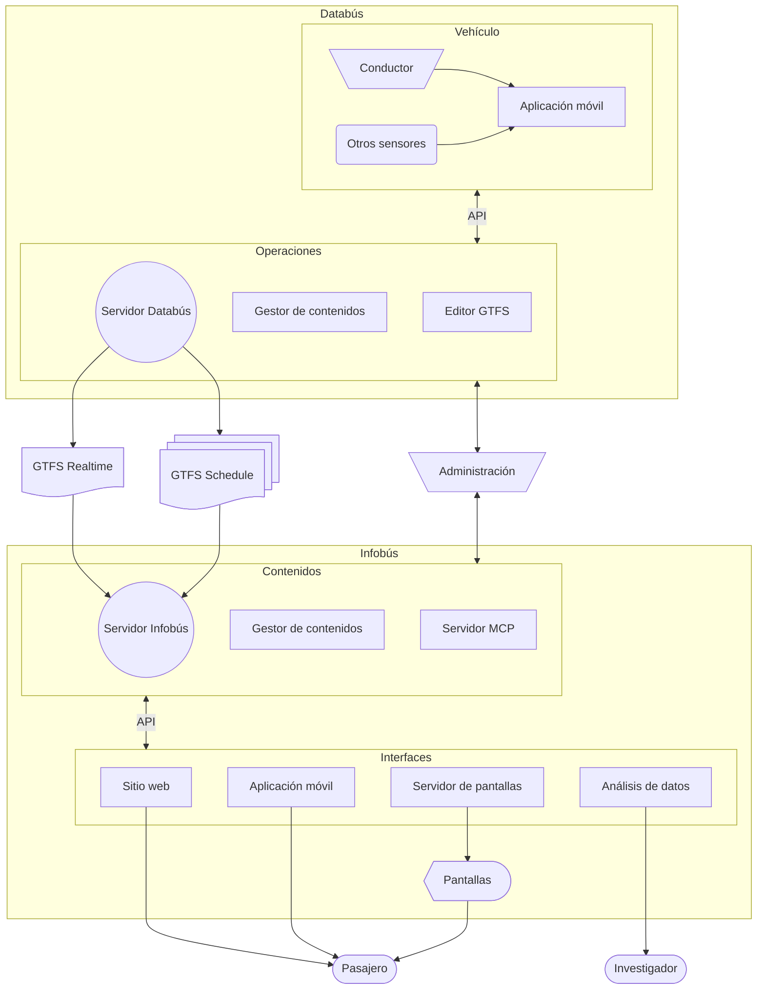

# Arquitectura del sistema

## Sistema

Infobús API --- Base de datos

--- Otras fuentes (clima)

Infobús Admin

Headless CMS: expone un API REST para la gestión de contenidos del sitio.

Infobús MCP
